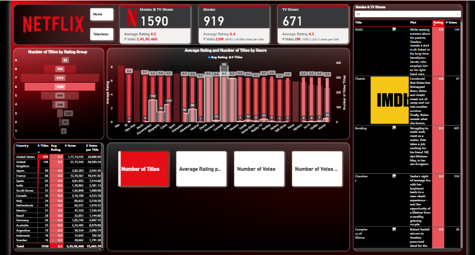

# Netfix_Analysis
# 📺 Netflix Data Analysis using Power BI

This project presents an insightful analysis of Netflix's global content library using Power BI. The dataset is sourced from Kaggle and includes movies and TV shows available on Netflix as of 2023.

## 🔧 Tools Used
- Power BI Desktop
- Dataset: `netflix_list.csv` from Kaggle
- [Optional] Python (for data preprocessing)

## 📊 Dashboard Highlights
- Total number of shows by type (Movies/TV Shows)
- Genre-wise distribution
- Country-wise content production
- Ratings and release year trend
- Global content footprint using maps

## 📷 Screenshot

## 🎥 Demo Video

[]

## 📁 Dataset

Dataset used from Kaggle: [Netflix Titles Dataset](https://www.kaggle.com/shivamb/netflix-shows)
